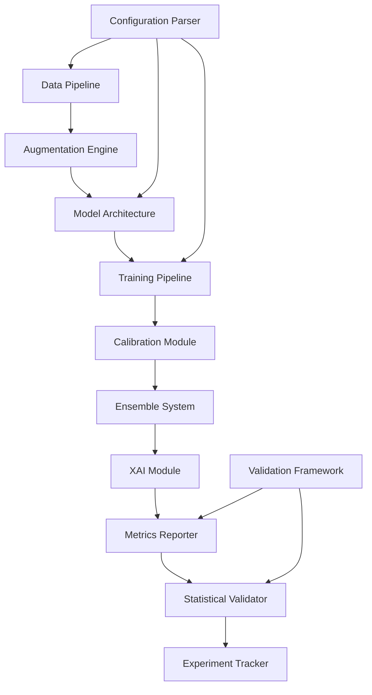

# Document de Design - Système Avancé de Classification du Cancer du Sein par Deep Learning

## Vue d'Ensemble

Ce document présente le design technique d'un système de recherche avancé pour la classification du cancer du sein par apprentissage profond sur images échographiques. Le système transforme un prototype existant (DenseNet121, 70% accuracy, 68.88% macro-F1) en un pipeline de qualité publication pour les revues Medical Image Analysis ou IEEE TMI.

### Contexte Expérimental

**Résultats Baseline DenseNet121 (RÉUSSI):**
- Accuracy: 70.0%
- Macro-F1: 68.88% [IC 95%: 62.40% — 74.67%]
- AUC-ROC: 91.52%
- Recall malignant: 89.06%
- Precision malignant: 58.76%
- Recall benign: 58.52% (PROBLÉMATIQUE)

**Tentative EfficientNetV2-S (ÉCHEC):**
- Accuracy: 51.67% (-18.33% vs baseline)
- Causes: Architecture trop complexe (21M params pour 780 images), hyperparamètres non adaptés, catastrophic forgetting

**Insights Critiques:**
1. DenseNet121 est l'architecture optimale pour BUSI (7M params, dense connections)
2. Le problème principal est la calibration, pas l'architecture (AUC 91.52% montre une bonne discrimination)
3. Le déséquilibre de classes impacte sévèrement le recall benign (58.52%)
4. La precision malignant trop basse (58.76%) suggère une miscalibration des seuils

### Objectifs du Design

1. **Conserver DenseNet121 comme architecture primaire** (prouvée efficace)
2. **Focus sur calibration et optimisation des seuils** (gains rapides)
3. **Implémenter augmentation médicale avancée** (déformations élastiques, speckle noise)
4. **Ajouter apprentissage cost-sensitive** pour le déséquilibre de classes
5. **Implémenter ensemble de 3 modèles DenseNet121** (seeds différentes)
6. **Ajouter XAI complet** (Grad-CAM++, analyse des échecs)
7. **Validation statistique rigoureuse** (bootstrap CI, test de McNemar)

### Contraintes Techniques

- **Dataset:** BUSI (780 images: 437 benign, 210 malignant, 133 normal)
- **Split actuel:** 1104 train, 236 val, 240 test
- **Taille d'entrée:** 224×224×3
- **Framework:** TensorFlow/Keras
- **Disponible:** Focal Loss, CBAM attention, Mixup augmentation, TTA

### Cibles de Performance

- **Baseline:** 70.0% accuracy, 68.88% macro-F1
- **Après calibration:** 74-77% macro-F1 (+5-8%)
- **Après training optimisé:** 76-80% macro-F1 (+7-11%)
- **Après ensemble:** 78-82% macro-F1 (+9-13%)


## Architecture

### Architecture Système Globale

Le système est composé de 10 modules principaux interconnectés:



### Flux de Données

**Phase d'Entraînement:**
```
Images BUSI → Prétraitement → Augmentation → Batch Formation → 
Model Training → Checkpoint Saving → Validation → Calibration → 
Metrics Computation → Statistical Analysis → Experiment Logging
```

**Phase d'Inférence:**
```
Image Input → Preprocessing → TTA Application → Ensemble Prediction → 
Calibration → Threshold Application → XAI Generation → 
Confidence Scoring → Result Output
```

### Pipeline d'Entraînement en Stages

Le pipeline d'entraînement suit une approche progressive en 3 phases:

**Phase 1: Frozen Backbone (5 epochs)**
- Backbone DenseNet121 gelé
- Entraînement classification head uniquement
- Learning rate: 1e-3
- Objectif: Adapter le head au dataset BUSI

**Phase 2: Fine-tuning Progressif (15 epochs)**
- Dégel progressif des couches (du haut vers le bas)
- Learning rate discriminatif: 1e-5 (backbone) à 1e-4 (head)
- Cosine annealing avec warm restarts
- Objectif: Adapter les features au domaine médical

**Phase 3: Full Fine-tuning (10 epochs)**
- Toutes les couches dégelées
- Learning rate: 1e-5
- Early stopping sur validation recall malignant
- Objectif: Optimisation finale


## Composants et Interfaces

### 1. Configuration Parser

**Responsabilité:** Parser et valider les fichiers de configuration expérimentale (YAML/JSON).

**Interface:**
```python
class ExperimentConfig:
    model_name: str
    dataset_path: str
    hyperparameters: Dict[str, Any]
    augmentation_config: AugmentationConfig
    training_config: TrainingConfig
    
class ConfigParser:
    def parse(config_file: Path) -> Result[ExperimentConfig, ParseError]
    def validate(config: ExperimentConfig) -> Result[None, ValidationError]
    def pretty_print(config: ExperimentConfig) -> str
```

**Validation:**
- Vérification des champs requis (model_name, dataset_path, hyperparameters)
- Validation des plages de valeurs (learning_rate > 0, batch_size puissance de 2)
- Validation de l'existence des chemins de fichiers
- Propriété round-trip: parse(pretty_print(config)) == config

### 2. Data Pipeline

**Responsabilité:** Chargement, prétraitement et gestion du dataset BUSI.

**Interface:**
```python
class DataPipeline:
    def load_busi_dataset(path: Path, split_ratio: Tuple[float, float, float]) -> Dataset
    def preprocess_image(image: np.ndarray) -> np.ndarray
    def apply_clahe(image: np.ndarray, clip_limit: float) -> np.ndarray
    def normalize(image: np.ndarray, mean: np.ndarray, std: np.ndarray) -> np.ndarray
    def create_dataloaders(dataset: Dataset, batch_size: int) -> Tuple[DataLoader, DataLoader, DataLoader]
```

**Prétraitement Standard:**
1. Resize à 224×224 (preserve aspect ratio avec padding)
2. CLAHE (clip_limit=2.0, tile_grid_size=8×8)
3. Normalisation ImageNet (mean=[0.485, 0.456, 0.406], std=[0.229, 0.224, 0.225])
4. Conversion en tenseur float32

**Split Stratifié:**
- Train: 70% (546 images)
- Validation: 15% (117 images)
- Test: 15% (117 images)
- Stratification par classe pour maintenir les proportions

### 3. Augmentation Engine

**Responsabilité:** Appliquer des augmentations médicales spécialisées.

**Interface:**
```python
class AugmentationEngine:
    def apply_medical_augmentation(image: np.ndarray, mask: np.ndarray) -> Tuple[np.ndarray, np.ndarray]
    def elastic_deformation(image: np.ndarray, alpha: float, sigma: float) -> np.ndarray
    def add_speckle_noise(image: np.ndarray, variance: float) -> np.ndarray
    def apply_cutmix(image1: np.ndarray, image2: np.ndarray, lambda_: float) -> np.ndarray
    def apply_mixup(image1: np.ndarray, image2: np.ndarray, alpha: float) -> np.ndarray
    def test_time_augmentation(image: np.ndarray, n_augmentations: int) -> List[np.ndarray]
```

**Augmentations Médicales:**
1. **Elastic Deformation:** Simule variations tissulaires (alpha=34, sigma=4)
2. **Speckle Noise:** Caractéristique échographie (variance=0.01-0.05)
3. **CutMix:** Mélange régions entre images (lambda ~ Beta(1.0, 1.0))
4. **Mixup:** Interpolation linéaire images (alpha=0.2)
5. **Geometric:** Rotation (±15°), flip horizontal, zoom (0.9-1.1)
6. **Intensity:** Brightness (±20%), contrast (±20%), gamma (0.8-1.2)

**Contrainte de Plausibilité Anatomique:**
- Pas de flip vertical (orientation anatomique importante)
- Rotations limitées (±15° max)
- Déformations élastiques contrôlées (pas de distorsions extrêmes)

### 4. Model Architecture

**Responsabilité:** Définir et instancier les architectures de réseaux de neurones.

**Interface:**
```python
class ModelArchitecture:
    def build_densenet121_cbam(num_classes: int, pretrained: bool) -> tf.keras.Model
    def build_efficientnet_v2(variant: str, num_classes: int) -> tf.keras.Model
    def build_vision_transformer(patch_size: int, num_classes: int) -> tf.keras.Model
    def add_attention_mechanism(model: tf.keras.Model, mechanism: str) -> tf.keras.Model
    def get_model_summary(model: tf.keras.Model) -> ModelSummary
```

**Architecture Primaire: DenseNet121 + CBAM**

```
Input (224×224×3)
    ↓
DenseNet121 Backbone (ImageNet pretrained)
    ↓ (7×7×1024 feature maps)
CBAM Attention Module
    ↓ Channel Attention (1024 → 1024)
    ↓ Spatial Attention (7×7 → 7×7)
Global Average Pooling
    ↓ (1024,)
Dense Layer (1024 → 512, ReLU, Dropout 0.5)
    ↓
Dense Layer (512 → 256, ReLU, Dropout 0.3)
    ↓
Output Layer (256 → 3, Softmax)
```

**Paramètres:**
- Total: ~7.5M params
- Trainable (phase 1): ~1.5M params (head uniquement)
- Trainable (phase 3): ~7.5M params (full model)

**Architectures Alternatives (pour comparaison):**
- EfficientNetV2-S (21M params) - ÉVITER pour BUSI
- Vision Transformer ViT-B/16 (86M params) - Tester avec forte régularisation
- Swin Transformer Tiny (28M params) - Tester avec curriculum learning


### 5. Training Pipeline

**Responsabilité:** Orchestrer l'entraînement avec stratégies avancées.

**Interface:**
```python
class TrainingPipeline:
    def train_progressive(model: tf.keras.Model, config: TrainingConfig) -> TrainingHistory
    def apply_focal_loss(y_true: tf.Tensor, y_pred: tf.Tensor, gamma: float, alpha: List[float]) -> tf.Tensor
    def apply_class_weights(class_distribution: Dict[int, int]) -> Dict[int, float]
    def create_optimizer(learning_rate: float, schedule: str) -> tf.keras.optimizers.Optimizer
    def early_stopping_callback(monitor: str, patience: int) -> tf.keras.callbacks.Callback
```

**Stratégie d'Entraînement Progressive:**

**Phase 1: Frozen Backbone (epochs 1-5)**
```python
# Geler backbone DenseNet121
for layer in model.layers[:-6]:
    layer.trainable = False

optimizer = Adam(learning_rate=1e-3)
loss = FocalLoss(gamma=2.0, alpha=[0.5, 1.5, 1.0])  # Priorité malignant
```

**Phase 2: Fine-tuning Progressif (epochs 6-20)**
```python
# Dégel progressif par blocs de dense blocks
# Epoch 6-10: Dense Block 4
# Epoch 11-15: Dense Blocks 3-4
# Epoch 16-20: Dense Blocks 2-4

optimizer = Adam(learning_rate=CosineAnnealingSchedule(
    initial_lr=1e-4,
    min_lr=1e-6,
    T_0=5,  # Warm restart every 5 epochs
    T_mult=2
))
```

**Phase 3: Full Fine-tuning (epochs 21-30)**
```python
# Toutes les couches dégelées
for layer in model.layers:
    layer.trainable = True

optimizer = Adam(learning_rate=1e-5)
early_stopping = EarlyStopping(
    monitor='val_recall_malignant',
    patience=5,
    mode='max',
    restore_best_weights=True
)
```

**Fonctions de Perte Avancées:**

1. **Focal Loss (primaire):**
```python
FL(p_t) = -α_t * (1 - p_t)^γ * log(p_t)
# γ = 2.0 (focus sur exemples difficiles)
# α = [0.5, 1.5, 1.0] (poids par classe: normal, malignant, benign)
```

2. **Asymmetric Loss (alternative):**
```python
ASL(p) = -(1 - p)^γ+ * log(p) * y - p^γ- * log(1 - p) * (1 - y)
# γ+ = 0 (pas de focus sur positifs)
# γ- = 4 (fort focus sur faux négatifs malignants)
```

3. **Compound Loss (expérimental):**
```python
L_total = λ1 * FocalLoss + λ2 * DiceLoss
# λ1 = 0.7, λ2 = 0.3
```

**Gestion du Déséquilibre de Classes:**

1. **Class-Balanced Sampling:**
```python
# Probabilité d'échantillonnage inversement proportionnelle à la fréquence
p_class = 1 / (n_samples_class * n_classes)
```

2. **Class Weights:**
```python
# Poids inversement proportionnels à la fréquence
w_class = n_total / (n_classes * n_samples_class)
# Normal: 780/(3*133) = 1.95
# Malignant: 780/(3*210) = 1.24
# Benign: 780/(3*437) = 0.59
```

3. **Two-Stage Training:**
```python
# Stage 1: Balanced sampling (10 epochs)
# Stage 2: Natural distribution (20 epochs)
```

### 6. Calibration Module

**Responsabilité:** Calibrer les scores de confiance et optimiser les seuils de décision.

**Interface:**
```python
class CalibrationModule:
    def temperature_scaling(logits: np.ndarray, temperature: float) -> np.ndarray
    def isotonic_regression_calibration(probs: np.ndarray, labels: np.ndarray) -> IsotonicRegression
    def optimize_thresholds(probs: np.ndarray, labels: np.ndarray, cost_matrix: np.ndarray) -> np.ndarray
    def compute_ece(probs: np.ndarray, labels: np.ndarray, n_bins: int) -> float
    def generate_reliability_diagram(probs: np.ndarray, labels: np.ndarray) -> Figure
```

**Temperature Scaling:**
```python
# Optimiser température T sur validation set
calibrated_probs = softmax(logits / T)

# Objectif: Minimiser Negative Log-Likelihood
T_optimal = argmin_T NLL(softmax(logits / T), labels)
```

**Optimisation Multi-Seuils:**

Pour chaque classe, optimiser le seuil de décision selon une matrice de coûts cliniques:

```python
# Matrice de coûts (coût de prédire colonne quand vérité est ligne)
cost_matrix = [
    [0,   10,  5],   # Normal: FP malignant coûte 10, FP benign coûte 5
    [100, 0,   20],  # Malignant: FN coûte 100 (critique), confusion benign coûte 20
    [10,  30,  0]    # Benign: FN coûte 10, confusion malignant coûte 30
]

# Optimiser seuils pour minimiser coût total
thresholds_optimal = optimize_cost_sensitive_thresholds(probs, labels, cost_matrix)
```

**Métriques de Calibration:**
- **Expected Calibration Error (ECE):** Moyenne des écarts entre confiance et accuracy par bin
- **Maximum Calibration Error (MCE):** Écart maximum entre confiance et accuracy
- **Brier Score:** Moyenne des carrés des écarts entre probs et labels

### 7. Ensemble System

**Responsabilité:** Combiner plusieurs modèles pour améliorer les performances.

**Interface:**
```python
class EnsembleSystem:
    def train_ensemble(n_models: int, seeds: List[int]) -> List[tf.keras.Model]
    def majority_voting(predictions: List[np.ndarray]) -> np.ndarray
    def weighted_voting(predictions: List[np.ndarray], weights: List[float]) -> np.ndarray
    def stacking_meta_learner(predictions: List[np.ndarray], labels: np.ndarray) -> MetaLearner
    def compute_prediction_variance(predictions: List[np.ndarray]) -> np.ndarray
```

**Stratégie d'Ensemble Primaire: 3× DenseNet121**

```python
# Entraîner 3 modèles DenseNet121 avec seeds différentes
ensemble = [
    train_model(seed=42),
    train_model(seed=123),
    train_model(seed=456)
]

# Prédiction par weighted voting
weights = [0.35, 0.35, 0.30]  # Basé sur validation macro-F1
final_pred = weighted_average(ensemble_preds, weights)
```

**Stratégie d'Ensemble Secondaire: Stacking**

```python
# Niveau 0: Modèles de base
base_models = [
    DenseNet121_CBAM,
    EfficientNetV2_S,
    ViT_Tiny
]

# Niveau 1: Meta-learner (XGBoost)
meta_learner = XGBClassifier(
    n_estimators=100,
    max_depth=3,
    learning_rate=0.1
)

# Entraînement par cross-validation pour éviter overfitting
meta_features = cross_val_predict(base_models, X_train, cv=5)
meta_learner.fit(meta_features, y_train)
```

**Test-Time Augmentation (TTA):**

```python
# Appliquer N augmentations à l'image de test
augmentations = [
    original,
    horizontal_flip,
    rotate_5_degrees,
    rotate_minus_5_degrees,
    brightness_plus_10,
    brightness_minus_10
]

# Prédire sur chaque version et moyenner
tta_predictions = [model.predict(aug_image) for aug_image in augmentations]
final_pred = np.mean(tta_predictions, axis=0)
```

**Métriques de Diversité:**
- **Disagreement:** Proportion de cas où les modèles prédisent différemment
- **Q-statistic:** Corrélation entre erreurs de paires de modèles
- **Kappa statistic:** Accord inter-modèles ajusté par le hasard


### 8. XAI Module

**Responsabilité:** Générer des explications visuelles et analyser les cas d'échec.

**Interface:**
```python
class XAIModule:
    def generate_gradcam_plusplus(model: tf.keras.Model, image: np.ndarray, class_idx: int) -> np.ndarray
    def generate_integrated_gradients(model: tf.keras.Model, image: np.ndarray, baseline: np.ndarray) -> np.ndarray
    def visualize_attention_maps(model: tf.keras.Model, image: np.ndarray) -> np.ndarray
    def overlay_heatmap(image: np.ndarray, heatmap: np.ndarray, alpha: float) -> np.ndarray
    def analyze_failure_cases(predictions: np.ndarray, labels: np.ndarray, images: np.ndarray) -> FailureAnalysis
    def quantify_uncertainty(predictions: List[np.ndarray]) -> np.ndarray
```

**Grad-CAM++ Implementation:**

```python
# Grad-CAM++ améliore Grad-CAM avec pondération des gradients
def gradcam_plusplus(model, image, class_idx, layer_name='conv5_block16_concat'):
    # 1. Forward pass
    with tf.GradientTape() as tape:
        conv_outputs = model.get_layer(layer_name).output
        predictions = model(image)
        class_output = predictions[:, class_idx]
    
    # 2. Calcul des gradients
    grads = tape.gradient(class_output, conv_outputs)
    
    # 3. Pondération Grad-CAM++ (alpha weights)
    alpha = grads / (2 * grads + tf.reduce_sum(conv_outputs * grads**3, axis=(1,2), keepdims=True))
    weights = tf.reduce_sum(alpha * tf.nn.relu(grads), axis=(1,2))
    
    # 4. Combinaison linéaire des feature maps
    cam = tf.reduce_sum(weights[:, :, None, None] * conv_outputs, axis=-1)
    cam = tf.nn.relu(cam)
    
    # 5. Normalisation et resize
    cam = (cam - tf.reduce_min(cam)) / (tf.reduce_max(cam) - tf.reduce_min(cam))
    cam = tf.image.resize(cam, (224, 224))
    
    return cam
```

**Integrated Gradients:**

```python
# Attribution des pixels par intégration des gradients
def integrated_gradients(model, image, baseline, steps=50):
    # Interpolation linéaire entre baseline et image
    alphas = tf.linspace(0.0, 1.0, steps)
    interpolated_images = baseline + alphas[:, None, None, None] * (image - baseline)
    
    # Calcul des gradients pour chaque interpolation
    gradients = []
    for interpolated_image in interpolated_images:
        with tf.GradientTape() as tape:
            tape.watch(interpolated_image)
            pred = model(interpolated_image)
        grad = tape.gradient(pred, interpolated_image)
        gradients.append(grad)
    
    # Intégration par méthode des trapèzes
    avg_gradients = tf.reduce_mean(gradients, axis=0)
    integrated_grads = (image - baseline) * avg_gradients
    
    return integrated_grads
```

**Analyse des Cas d'Échec:**

```python
class FailureAnalysis:
    def identify_misclassified(predictions, labels) -> List[int]:
        """Identifie les indices des images mal classées"""
        return np.where(predictions != labels)[0]
    
    def cluster_failures(images, embeddings, n_clusters=5) -> Dict[int, List[int]]:
        """Groupe les échecs par similarité visuelle"""
        kmeans = KMeans(n_clusters=n_clusters)
        clusters = kmeans.fit_predict(embeddings)
        return {i: np.where(clusters == i)[0] for i in range(n_clusters)}
    
    def analyze_confidence_errors(predictions_probs, labels) -> Dict[str, float]:
        """Analyse la corrélation confiance-erreur"""
        correct = predictions_probs.argmax(axis=1) == labels
        confidence = predictions_probs.max(axis=1)
        
        return {
            'avg_confidence_correct': confidence[correct].mean(),
            'avg_confidence_incorrect': confidence[~correct].mean(),
            'high_confidence_errors': ((confidence > 0.9) & ~correct).sum()
        }
    
    def identify_ambiguous_cases(ensemble_predictions) -> List[int]:
        """Identifie les cas où l'ensemble est en désaccord"""
        disagreement = np.std(ensemble_predictions, axis=0).max(axis=1)
        return np.where(disagreement > 0.3)[0]
```

**Quantification de l'Incertitude:**

```python
# Incertitude épistémique (model uncertainty) via ensemble
epistemic_uncertainty = np.std([model.predict(x) for model in ensemble], axis=0)

# Incertitude aléatoire (data uncertainty) via dropout à l'inférence
aleatoric_uncertainty = np.std([model.predict(x, training=True) for _ in range(30)], axis=0)

# Incertitude totale
total_uncertainty = epistemic_uncertainty + aleatoric_uncertainty
```

### 9. Metrics Reporter

**Responsabilité:** Calculer et rapporter toutes les métriques cliniques.

**Interface:**
```python
class MetricsReporter:
    def compute_clinical_metrics(y_true: np.ndarray, y_pred: np.ndarray, y_probs: np.ndarray) -> ClinicalMetrics
    def generate_confusion_matrix(y_true: np.ndarray, y_pred: np.ndarray) -> np.ndarray
    def compute_roc_curves(y_true: np.ndarray, y_probs: np.ndarray) -> Dict[int, Tuple[np.ndarray, np.ndarray]]
    def compute_pr_curves(y_true: np.ndarray, y_probs: np.ndarray) -> Dict[int, Tuple[np.ndarray, np.ndarray]]
    def generate_latex_table(metrics: ClinicalMetrics) -> str
```

**Métriques Cliniques Complètes:**

```python
class ClinicalMetrics:
    # Métriques globales
    accuracy: float
    macro_f1: float
    weighted_f1: float
    
    # Métriques par classe
    per_class_metrics: Dict[str, ClassMetrics]
    
    # Métriques ROC
    auc_roc: Dict[str, float]  # One-vs-rest pour chaque classe
    
    # Métriques PR
    average_precision: Dict[str, float]
    
    # Matrice de confusion
    confusion_matrix: np.ndarray

class ClassMetrics:
    sensitivity: float  # Recall / True Positive Rate
    specificity: float  # True Negative Rate
    ppv: float          # Positive Predictive Value / Precision
    npv: float          # Negative Predictive Value
    f1_score: float
    support: int        # Nombre d'échantillons
```

**Calcul des Métriques par Classe (One-vs-Rest):**

```python
def compute_class_metrics(y_true, y_pred, class_idx):
    # Binariser pour one-vs-rest
    y_true_binary = (y_true == class_idx).astype(int)
    y_pred_binary = (y_pred == class_idx).astype(int)
    
    # Matrice de confusion 2×2
    tn, fp, fn, tp = confusion_matrix(y_true_binary, y_pred_binary).ravel()
    
    # Métriques
    sensitivity = tp / (tp + fn)  # Recall
    specificity = tn / (tn + fp)
    ppv = tp / (tp + fp)          # Precision
    npv = tn / (tn + fn)
    f1 = 2 * (ppv * sensitivity) / (ppv + sensitivity)
    
    return ClassMetrics(sensitivity, specificity, ppv, npv, f1, tp + fn)
```

**Génération de Courbes ROC Multi-Classes:**

```python
def compute_multiclass_roc(y_true, y_probs, n_classes=3):
    roc_curves = {}
    auc_scores = {}
    
    for class_idx in range(n_classes):
        # One-vs-rest binarization
        y_true_binary = (y_true == class_idx).astype(int)
        y_score = y_probs[:, class_idx]
        
        # Calcul ROC
        fpr, tpr, thresholds = roc_curve(y_true_binary, y_score)
        auc = roc_auc_score(y_true_binary, y_score)
        
        roc_curves[class_idx] = (fpr, tpr, thresholds)
        auc_scores[class_idx] = auc
    
    return roc_curves, auc_scores
```

### 10. Statistical Validator

**Responsabilité:** Effectuer les tests statistiques et calculer les intervalles de confiance.

**Interface:**
```python
class StatisticalValidator:
    def bootstrap_confidence_interval(metric_fn: Callable, y_true: np.ndarray, y_pred: np.ndarray, 
                                     n_iterations: int, confidence_level: float) -> Tuple[float, float]
    def mcnemar_test(y_true: np.ndarray, y_pred1: np.ndarray, y_pred2: np.ndarray) -> Tuple[float, float]
    def delong_test(y_true: np.ndarray, y_score1: np.ndarray, y_score2: np.ndarray) -> Tuple[float, float]
    def perform_cross_validation(model_fn: Callable, X: np.ndarray, y: np.ndarray, k: int) -> CVResults
```

**Bootstrap Confidence Intervals:**

```python
def bootstrap_ci(metric_fn, y_true, y_pred, n_iterations=1000, confidence_level=0.95):
    """
    Calcule l'intervalle de confiance par bootstrap
    """
    n_samples = len(y_true)
    bootstrap_metrics = []
    
    for _ in range(n_iterations):
        # Échantillonnage avec remplacement
        indices = np.random.choice(n_samples, size=n_samples, replace=True)
        y_true_boot = y_true[indices]
        y_pred_boot = y_pred[indices]
        
        # Calcul de la métrique
        metric = metric_fn(y_true_boot, y_pred_boot)
        bootstrap_metrics.append(metric)
    
    # Calcul des percentiles
    alpha = 1 - confidence_level
    lower = np.percentile(bootstrap_metrics, 100 * alpha / 2)
    upper = np.percentile(bootstrap_metrics, 100 * (1 - alpha / 2))
    
    return lower, upper
```

**Test de McNemar:**

```python
def mcnemar_test(y_true, y_pred1, y_pred2):
    """
    Test de McNemar pour comparer deux modèles sur les mêmes données
    H0: Les deux modèles ont la même performance
    """
    # Matrice de contingence
    correct1 = (y_pred1 == y_true)
    correct2 = (y_pred2 == y_true)
    
    n01 = np.sum(~correct1 & correct2)  # Modèle 1 faux, Modèle 2 correct
    n10 = np.sum(correct1 & ~correct2)  # Modèle 1 correct, Modèle 2 faux
    
    # Statistique de test (avec correction de continuité)
    statistic = (abs(n01 - n10) - 1)**2 / (n01 + n10)
    
    # P-value (distribution chi-carré à 1 degré de liberté)
    p_value = 1 - chi2.cdf(statistic, df=1)
    
    return statistic, p_value
```

**Test de DeLong:**

```python
def delong_test(y_true, y_score1, y_score2):
    """
    Test de DeLong pour comparer deux courbes ROC
    H0: Les deux AUC sont égales
    """
    from scipy.stats import norm
    
    # Calcul des AUC
    auc1 = roc_auc_score(y_true, y_score1)
    auc2 = roc_auc_score(y_true, y_score2)
    
    # Calcul de la variance de la différence (méthode de DeLong)
    # Implémentation simplifiée - utiliser sklearn.metrics.roc_auc_score avec covariance
    variance = compute_delong_variance(y_true, y_score1, y_score2)
    
    # Statistique de test
    z_statistic = (auc1 - auc2) / np.sqrt(variance)
    
    # P-value (test bilatéral)
    p_value = 2 * (1 - norm.cdf(abs(z_statistic)))
    
    return z_statistic, p_value
```

**Cross-Validation Stratifiée:**

```python
def stratified_k_fold_cv(model_fn, X, y, k=5):
    """
    Cross-validation stratifiée k-fold
    """
    skf = StratifiedKFold(n_splits=k, shuffle=True, random_state=42)
    
    cv_results = {
        'fold_metrics': [],
        'fold_predictions': [],
        'fold_indices': []
    }
    
    for fold_idx, (train_idx, val_idx) in enumerate(skf.split(X, y)):
        X_train, X_val = X[train_idx], X[val_idx]
        y_train, y_val = y[train_idx], y[val_idx]
        
        # Entraîner le modèle
        model = model_fn()
        model.fit(X_train, y_train)
        
        # Prédictions
        y_pred = model.predict(X_val)
        y_probs = model.predict_proba(X_val)
        
        # Métriques
        metrics = compute_clinical_metrics(y_val, y_pred, y_probs)
        
        cv_results['fold_metrics'].append(metrics)
        cv_results['fold_predictions'].append((y_val, y_pred, y_probs))
        cv_results['fold_indices'].append((train_idx, val_idx))
    
    # Agrégation des résultats
    cv_results['mean_metrics'] = aggregate_metrics(cv_results['fold_metrics'])
    cv_results['std_metrics'] = compute_std_metrics(cv_results['fold_metrics'])
    
    return cv_results
```

### 11. Experiment Tracker

**Responsabilité:** Suivre et logger toutes les expériences pour reproductibilité.

**Interface:**
```python
class ExperimentTracker:
    def init_experiment(experiment_name: str, config: ExperimentConfig) -> str
    def log_hyperparameters(experiment_id: str, hyperparams: Dict[str, Any]) -> None
    def log_metrics(experiment_id: str, metrics: Dict[str, float], step: int) -> None
    def log_model(experiment_id: str, model: tf.keras.Model, metadata: Dict[str, Any]) -> None
    def log_artifact(experiment_id: str, artifact_path: Path, artifact_type: str) -> None
    def compare_experiments(experiment_ids: List[str]) -> ComparisonReport
```

**Intégration MLflow:**

```python
import mlflow
import mlflow.tensorflow

def track_experiment(config: ExperimentConfig):
    # Initialiser l'expérience
    mlflow.set_experiment(config.experiment_name)
    
    with mlflow.start_run(run_name=config.run_name):
        # Logger les hyperparamètres
        mlflow.log_params({
            'model_architecture': config.model_name,
            'learning_rate': config.learning_rate,
            'batch_size': config.batch_size,
            'augmentation_strategy': config.augmentation_config.strategy,
            'loss_function': config.loss_function,
            'optimizer': config.optimizer
        })
        
        # Logger les seeds pour reproductibilité
        mlflow.log_params({
            'random_seed': config.random_seed,
            'numpy_seed': config.numpy_seed,
            'tensorflow_seed': config.tensorflow_seed
        })
        
        # Logger les versions des packages
        mlflow.log_param('tensorflow_version', tf.__version__)
        mlflow.log_param('numpy_version', np.__version__)
        
        # Entraîner le modèle
        history = train_model(config)
        
        # Logger les métriques par epoch
        for epoch in range(len(history.history['loss'])):
            mlflow.log_metrics({
                'train_loss': history.history['loss'][epoch],
                'train_accuracy': history.history['accuracy'][epoch],
                'val_loss': history.history['val_loss'][epoch],
                'val_accuracy': history.history['val_accuracy'][epoch],
                'val_macro_f1': history.history['val_macro_f1'][epoch]
            }, step=epoch)
        
        # Logger le modèle final
        mlflow.tensorflow.log_model(model, 'model')
        
        # Logger les artefacts (courbes, matrices de confusion, etc.)
        mlflow.log_artifact('confusion_matrix.png')
        mlflow.log_artifact('roc_curves.png')
        mlflow.log_artifact('training_curves.png')
        
        # Logger les prédictions sur le test set
        test_predictions = model.predict(X_test)
        np.save('test_predictions.npy', test_predictions)
        mlflow.log_artifact('test_predictions.npy')
```

**Garanties de Reproductibilité:**

```python
def set_reproducibility_seeds(seed=42):
    """
    Fixe toutes les sources d'aléatoire pour reproductibilité
    """
    # Python
    import random
    random.seed(seed)
    
    # NumPy
    np.random.seed(seed)
    
    # TensorFlow
    tf.random.set_seed(seed)
    
    # CUDA (si GPU disponible)
    os.environ['PYTHONHASHSEED'] = str(seed)
    os.environ['TF_DETERMINISTIC_OPS'] = '1'
    os.environ['TF_CUDNN_DETERMINISTIC'] = '1'
    
    # Configuration TensorFlow pour déterminisme
    tf.config.threading.set_inter_op_parallelism_threads(1)
    tf.config.threading.set_intra_op_parallelism_threads(1)
```


## Modèles de Données

### ExperimentConfig

Configuration complète d'une expérience d'entraînement.

```python
@dataclass
class ExperimentConfig:
    # Identification
    experiment_name: str
    run_name: str
    random_seed: int = 42
    
    # Architecture
    model_name: str  # 'densenet121', 'efficientnetv2_s', 'vit_b16'
    pretrained: bool = True
    attention_mechanism: Optional[str] = 'cbam'  # 'cbam', 'se', None
    
    # Dataset
    dataset_path: Path
    split_ratio: Tuple[float, float, float] = (0.7, 0.15, 0.15)
    input_size: Tuple[int, int] = (224, 224)
    
    # Hyperparamètres d'entraînement
    hyperparameters: TrainingHyperparameters
    
    # Augmentation
    augmentation_config: AugmentationConfig
    
    # Loss et optimisation
    loss_function: str = 'focal_loss'
    loss_params: Dict[str, Any] = field(default_factory=lambda: {'gamma': 2.0, 'alpha': [0.5, 1.5, 1.0]})
    optimizer: str = 'adam'
    
    # Callbacks
    early_stopping_patience: int = 5
    reduce_lr_patience: int = 3
    
    # Validation
    use_cross_validation: bool = False
    n_folds: int = 5
    
    # Ensemble
    ensemble_size: int = 1
    ensemble_seeds: List[int] = field(default_factory=lambda: [42])

@dataclass
class TrainingHyperparameters:
    # Progressive training phases
    phase1_epochs: int = 5
    phase1_lr: float = 1e-3
    phase1_frozen_layers: int = -6  # Freeze all except last 6 layers
    
    phase2_epochs: int = 15
    phase2_lr_initial: float = 1e-4
    phase2_lr_min: float = 1e-6
    phase2_schedule: str = 'cosine_annealing'
    
    phase3_epochs: int = 10
    phase3_lr: float = 1e-5
    
    # Batch size
    batch_size: int = 16
    
    # Regularization
    weight_decay: float = 1e-4
    dropout_rate: float = 0.5
    label_smoothing: float = 0.0
    
    # Class imbalance
    use_class_weights: bool = True
    use_balanced_sampling: bool = False

@dataclass
class AugmentationConfig:
    # Geometric
    rotation_range: float = 15.0
    horizontal_flip: bool = True
    vertical_flip: bool = False
    zoom_range: Tuple[float, float] = (0.9, 1.1)
    
    # Intensity
    brightness_range: Tuple[float, float] = (0.8, 1.2)
    contrast_range: Tuple[float, float] = (0.8, 1.2)
    gamma_range: Tuple[float, float] = (0.8, 1.2)
    
    # Medical-specific
    use_elastic_deformation: bool = True
    elastic_alpha: float = 34.0
    elastic_sigma: float = 4.0
    
    use_speckle_noise: bool = True
    speckle_variance: float = 0.03
    
    # Advanced
    use_mixup: bool = True
    mixup_alpha: float = 0.2
    
    use_cutmix: bool = True
    cutmix_alpha: float = 1.0
    
    # Test-time augmentation
    use_tta: bool = True
    tta_n_augmentations: int = 6
```

### ClinicalMetrics

Métriques cliniques complètes pour évaluation.

```python
@dataclass
class ClassMetrics:
    """Métriques pour une classe spécifique (one-vs-rest)"""
    class_name: str
    sensitivity: float  # Recall / TPR
    specificity: float  # TNR
    ppv: float          # Precision / Positive Predictive Value
    npv: float          # Negative Predictive Value
    f1_score: float
    auc_roc: float
    average_precision: float  # Area under PR curve
    support: int        # Number of samples

@dataclass
class ClinicalMetrics:
    """Métriques globales et par classe"""
    # Métriques globales
    accuracy: float
    macro_f1: float
    weighted_f1: float
    
    # Intervalles de confiance (bootstrap 95%)
    accuracy_ci: Tuple[float, float]
    macro_f1_ci: Tuple[float, float]
    
    # Métriques par classe
    normal_metrics: ClassMetrics
    malignant_metrics: ClassMetrics
    benign_metrics: ClassMetrics
    
    # Matrice de confusion
    confusion_matrix: np.ndarray  # Shape: (3, 3)
    
    # Métriques de calibration
    expected_calibration_error: float
    maximum_calibration_error: float
    brier_score: float
    
    def to_latex_table(self) -> str:
        """Génère un tableau LaTeX pour publication"""
        pass
    
    def to_dict(self) -> Dict[str, Any]:
        """Convertit en dictionnaire pour logging"""
        pass

@dataclass
class ComparisonMetrics:
    """Métriques de comparaison entre deux modèles"""
    model1_name: str
    model2_name: str
    
    # Tests statistiques
    mcnemar_statistic: float
    mcnemar_p_value: float
    
    delong_statistic: float
    delong_p_value: float
    
    # Différences de métriques
    accuracy_diff: float
    macro_f1_diff: float
    
    # Intervalles de confiance des différences
    accuracy_diff_ci: Tuple[float, float]
    macro_f1_diff_ci: Tuple[float, float]
    
    # Significativité
    is_significant: bool  # p < 0.05
```

### TrainingHistory

Historique d'entraînement avec métriques par epoch.

```python
@dataclass
class EpochMetrics:
    epoch: int
    train_loss: float
    train_accuracy: float
    val_loss: float
    val_accuracy: float
    val_macro_f1: float
    val_recall_malignant: float
    learning_rate: float
    duration_seconds: float

@dataclass
class TrainingHistory:
    """Historique complet d'entraînement"""
    experiment_id: str
    config: ExperimentConfig
    
    # Métriques par epoch
    epochs: List[EpochMetrics]
    
    # Best epoch
    best_epoch: int
    best_val_macro_f1: float
    
    # Temps total
    total_training_time: float
    
    # Ressources
    peak_memory_mb: float
    avg_gpu_utilization: float
    
    def plot_training_curves(self) -> Figure:
        """Génère les courbes d'entraînement"""
        pass
    
    def get_best_checkpoint_path(self) -> Path:
        """Retourne le chemin du meilleur checkpoint"""
        pass
```

### FailureAnalysis

Analyse des cas d'échec du modèle.

```python
@dataclass
class MisclassifiedCase:
    """Un cas mal classé"""
    image_id: str
    true_label: str
    predicted_label: str
    confidence: float
    
    # Explications
    gradcam_heatmap: np.ndarray
    integrated_gradients: np.ndarray
    
    # Métadonnées
    image_quality_score: float
    is_ambiguous: bool  # Désaccord dans l'ensemble
    cluster_id: int     # Cluster d'erreurs similaires

@dataclass
class FailureAnalysis:
    """Analyse complète des échecs"""
    total_misclassified: int
    misclassification_rate: float
    
    # Erreurs par type
    false_positives_malignant: int
    false_negatives_malignant: int
    benign_normal_confusion: int
    
    # Cas individuels
    misclassified_cases: List[MisclassifiedCase]
    
    # Patterns d'erreurs
    error_clusters: Dict[int, List[MisclassifiedCase]]
    
    # Corrélation confiance-erreur
    avg_confidence_correct: float
    avg_confidence_incorrect: float
    high_confidence_errors: int  # Confiance > 0.9 mais incorrect
    
    # Cas ambigus
    ambiguous_cases: List[MisclassifiedCase]  # Désaccord ensemble
    
    def generate_report(self) -> str:
        """Génère un rapport d'analyse des échecs"""
        pass
    
    def visualize_error_patterns(self) -> Figure:
        """Visualise les patterns d'erreurs"""
        pass
```

### ValidationResults

Résultats de validation croisée et externe.

```python
@dataclass
class FoldResults:
    """Résultats pour un fold de cross-validation"""
    fold_idx: int
    train_indices: np.ndarray
    val_indices: np.ndarray
    
    metrics: ClinicalMetrics
    predictions: np.ndarray
    prediction_probs: np.ndarray
    
    model_checkpoint_path: Path

@dataclass
class CrossValidationResults:
    """Résultats de cross-validation k-fold"""
    n_folds: int
    fold_results: List[FoldResults]
    
    # Métriques agrégées
    mean_accuracy: float
    std_accuracy: float
    mean_macro_f1: float
    std_macro_f1: float
    
    # Intervalles de confiance
    accuracy_ci: Tuple[float, float]
    macro_f1_ci: Tuple[float, float]
    
    def aggregate_predictions(self) -> np.ndarray:
        """Agrège les prédictions de tous les folds"""
        pass

@dataclass
class ExternalValidationResults:
    """Résultats de validation sur dataset externe"""
    source_dataset: str  # 'BUSI'
    target_dataset: str  # 'CBIS-DDSM'
    
    # Performance sur source (BUSI)
    source_metrics: ClinicalMetrics
    
    # Performance sur target (CBIS-DDSM)
    target_metrics: ClinicalMetrics
    
    # Dégradation de performance
    accuracy_drop: float
    macro_f1_drop: float
    
    # Domain adaptation appliquée
    domain_adaptation_method: Optional[str]
    adapted_metrics: Optional[ClinicalMetrics]
```

### EnsembleResults

Résultats d'un système d'ensemble.

```python
@dataclass
class EnsembleMember:
    """Un membre de l'ensemble"""
    model_id: str
    seed: int
    architecture: str
    
    validation_metrics: ClinicalMetrics
    weight: float  # Poids dans le voting

@dataclass
class EnsembleResults:
    """Résultats d'un ensemble de modèles"""
    ensemble_id: str
    members: List[EnsembleMember]
    
    # Stratégie d'ensemble
    voting_strategy: str  # 'majority', 'weighted', 'stacking'
    
    # Performance individuelle
    individual_metrics: List[ClinicalMetrics]
    
    # Performance ensemble
    ensemble_metrics: ClinicalMetrics
    
    # Amélioration vs meilleur modèle individuel
    best_individual_macro_f1: float
    ensemble_macro_f1: float
    improvement: float
    
    # Diversité
    disagreement_rate: float
    q_statistic: float
    kappa_statistic: float
    
    # Incertitude
    epistemic_uncertainty: np.ndarray  # Par prédiction
    
    def compare_to_best_individual(self) -> ComparisonMetrics:
        """Compare l'ensemble au meilleur modèle individuel"""
        pass
```


## Propriétés de Correction

*Une propriété est une caractéristique ou un comportement qui doit être vrai pour toutes les exécutions valides d'un système - essentiellement, une déclaration formelle sur ce que le système doit faire. Les propriétés servent de pont entre les spécifications lisibles par l'homme et les garanties de correction vérifiables par machine.*

### Réflexion sur les Propriétés

Après analyse des 100+ critères d'acceptation, plusieurs propriétés redondantes ont été identifiées et consolidées:

**Consolidations effectuées:**
1. Les propriétés 9.1-9.6 et 9.10 (enregistrement de diverses métadonnées) sont consolidées en une seule propriété sur l'enregistrement complet des expériences
2. Les propriétés 18.1-18.4 (invariances à différentes transformations) sont consolidées en une propriété générale d'invariance
3. Les propriétés 11.1-11.3 (identification et analyse des échecs) sont consolidées en une propriété sur l'analyse complète des échecs
4. Les propriétés 7.6 et 6.8 (intervalles de confiance bootstrap) sont consolidées
5. Les propriétés sur les tests statistiques (7.11, 12.5, 19.4) sont consolidées

**Propriétés éliminées comme redondantes:**
- Propriété sur l'enregistrement individuel des seeds (subsumée par enregistrement complet)
- Propriétés sur les invariances spécifiques (subsumées par invariance générale)
- Propriétés sur les métriques individuelles (subsumées par métriques complètes)

### Propriété 1: Round-Trip de Configuration

*Pour tout* objet ExperimentConfig valide, parser puis pretty-printer puis parser doit produire un objet équivalent.

**Valide: Exigences 15.4**

### Propriété 2: Validation des Configurations

*Pour toute* configuration fournie, le parser doit valider la présence des champs requis (model_name, dataset_path, hyperparameters) et les plages de valeurs des hyperparamètres.

**Valide: Exigences 15.5, 15.6**

### Propriété 3: Erreurs Descriptives de Parsing

*Pour toute* configuration invalide, le parser doit retourner une erreur descriptive indiquant le champ problématique.

**Valide: Exigences 15.2**

### Propriété 4: Préservation du Ratio d'Aspect

*Pour toute* image et toute dimension d'entrée configurée, le redimensionnement doit préserver le ratio d'aspect de l'image originale.

**Valide: Exigences 17.3**

### Propriété 5: Validation de l'Intégrité des Données

*Pour tout* dataset chargé, le système doit valider l'intégrité (pas d'images corrompues, labels corrects) et rapporter la distribution des classes pour chaque split.

**Valide: Exigences 17.5, 17.6**

### Propriété 6: Gestion Gracieuse des Fichiers Corrompus

*Pour tout* fichier de masque manquant ou corrompu, le système doit le gérer gracieusement sans crasher et logger l'erreur.

**Valide: Exigences 17.8, 20.6**

### Propriété 7: Métriques Par Classe

*Pour toute* technique de gestion du déséquilibre de classes appliquée, le Metrics_Reporter doit rapporter les métriques séparément pour chaque classe.

**Valide: Exigences 3.6**

### Propriété 8: Tuning d'Hyperparamètres Disponible

*Pour toute* fonction de perte sélectionnée, le Training_Pipeline doit permettre le tuning des hyperparamètres via grid search ou optimisation bayésienne.

**Valide: Exigences 4.7**

### Propriété 9: Confiance et Incertitude

*Pour toute* prédiction effectuée, le XAI_Module doit fournir des scores de confiance avec quantification de l'incertitude.

**Valide: Exigences 5.5**

### Propriété 10: Métriques de Dégradation Externe

*Pour toute* validation externe effectuée, le Validation_Framework doit rapporter les métriques de dégradation de performance.

**Valide: Exigences 6.4**

### Propriété 11: Intervalles de Confiance Bootstrap

*Pour toute* expérience de validation et toute métrique, le Statistical_Validator doit calculer des intervalles de confiance à 95% en utilisant bootstrap avec minimum 1000 itérations.

**Valide: Exigences 6.8, 7.6**

### Propriété 12: Tests de Significativité Statistique

*Pour toute* comparaison de modèles, le Statistical_Validator doit effectuer des tests de significativité statistique (McNemar pour prédictions, DeLong pour AUC) au seuil p<0.05.

**Valide: Exigences 7.11, 12.5, 19.4**

### Propriété 13: Incertitude d'Ensemble

*Pour toute* prédiction d'ensemble effectuée, le Ensemble_System doit fournir des estimations d'incertitude via la variance des prédictions.

**Valide: Exigences 8.6**

### Propriété 14: Comparaison Ensemble vs Meilleur Individuel

*Pour tout* ensemble de modèles, le système doit comparer la performance de l'ensemble contre le meilleur modèle individuel avec des tests statistiques.

**Valide: Exigences 8.7**

### Propriété 15: Métriques de Diversité d'Ensemble

*Pour tout* ensemble de modèles, le système doit analyser les métriques de diversité entre les membres (disagreement, Q-statistic).

**Valide: Exigences 8.8**

### Propriété 16: Enregistrement Complet des Expériences

*Pour toute* expérience d'entraînement, le Experiment_Tracker doit enregistrer: tous les seeds aléatoires, versions exactes des packages, tous les hyperparamètres, courbes d'entraînement à chaque epoch, utilisation mémoire GPU et temps d'entraînement, et prédictions sur le test set.

**Valide: Exigences 9.1, 9.2, 9.3, 9.4, 9.5, 9.10**

### Propriété 17: Versioning des Checkpoints

*Pour tout* checkpoint de modèle sauvegardé, le Experiment_Tracker doit inclure des métadonnées complètes (config, epoch, métriques).

**Valide: Exigences 9.6**

### Propriété 18: Rapport de Reproductibilité

*Pour toute* expérience complétée, le Experiment_Tracker doit générer un rapport de reproductibilité avec tous les détails de configuration.

**Valide: Exigences 9.8**

### Propriété 19: Cross-Validation Imbriquée

*Pour toute* recherche d'hyperparamètres effectuée, le système doit utiliser une cross-validation imbriquée pour éviter l'overfitting.

**Valide: Exigences 10.7**

### Propriété 20: Enregistrement des Essais d'Hyperparamètres

*Pour tout* essai d'hyperparamètre, le Experiment_Tracker doit enregistrer les hyperparamètres et la performance de validation correspondante.

**Valide: Exigences 10.8**

### Propriété 21: Analyse Complète des Échecs

*Pour tout* ensemble de prédictions, le système doit identifier et cataloguer toutes les images mal classées, calculer les taux d'erreur stratifiés par classe, et générer des visualisations d'explication pour tous les cas mal classés.

**Valide: Exigences 11.1, 11.2, 11.3**

### Propriété 22: Corrélation Confiance-Exactitude

*Pour tout* ensemble de prédictions, le système doit analyser la corrélation entre la confiance de prédiction et l'exactitude.

**Valide: Exigences 11.5**

### Propriété 23: Identification des Cas Ambigus

*Pour tout* ensemble de modèles, le système doit identifier les cas ambigus où plusieurs modèles sont en désaccord.

**Valide: Exigences 11.6**

### Propriété 24: Rapport d'Analyse des Échecs

*Pour toute* analyse d'échec effectuée, le système doit générer un rapport avec des exemples d'erreurs représentatifs.

**Valide: Exigences 11.7**

### Propriété 25: Splits Identiques pour Comparaisons

*Pour toute* comparaison de méthodes effectuée, le système doit utiliser des splits train/test identiques pour toutes les méthodes.

**Valide: Exigences 12.4**

### Propriété 26: Optimisation de Seuil sur Validation Uniquement

*Pour toute* optimisation de seuil effectuée, le Calibration_Module doit utiliser uniquement le validation set (pas le test set).

**Valide: Exigences 13.6**

### Propriété 27: Rapport aux Deux Seuils

*Pour toute* optimisation de seuil, le Metrics_Reporter doit rapporter la performance aux seuils par défaut (0.5) et optimisés.

**Valide: Exigences 13.8**

### Propriété 28: Résolution des Figures

*Pour toute* visualisation générée, le système doit produire des figures haute résolution (minimum 300 DPI).

**Valide: Exigences 14.2**

### Propriété 29: Commentaires dans Pretty-Printer

*Pour tout* objet ExperimentConfig pretty-printé, la sortie doit inclure des commentaires documentant chaque paramètre de configuration.

**Valide: Exigences 15.7**

### Propriété 30: Logging par Stage d'Entraînement

*Pour tout* entraînement progressif utilisé, le Training_Pipeline doit logger la performance après chaque stage d'entraînement.

**Valide: Exigences 16.6**

### Propriété 31: Sauvegarde des Checkpoints

*Pour tout* run d'entraînement, le Training_Pipeline doit sauvegarder des checkpoints à la meilleure performance de validation et à intervalles réguliers.

**Valide: Exigences 16.8**

### Propriété 32: Invariance aux Transformations Préservant le Diagnostic

*Pour toute* image et toute transformation d'augmentation qui préserve le diagnostic (flip horizontal, petites rotations ±10°, ajustements de luminosité dans la plage clinique), le Model_Architecture doit produire des prédictions avec confiance similaire (tolérance 5%) et maintenir la même classe prédite.

**Valide: Exigences 18.1, 18.2, 18.3, 18.4**

### Propriété 33: Rapport des Violations d'Invariance

*Pour tout* test set, le Validation_Framework doit rapporter le taux de violation d'invariance et identifier les images où les propriétés d'invariance sont violées.

**Valide: Exigences 18.5, 18.6**

### Propriété 34: Analyse de Désaccord Modèle Simple vs Complexe

*Pour tout* désaccord entre le modèle avancé et le baseline simple, le système doit analyser lequel est correct plus souvent.

**Valide: Exigences 19.2**

### Propriété 35: Mesure du Gap de Performance

*Pour toute* paire de modèles (simple et complexe), le système doit mesurer le gap de performance et analyser les trade-offs coût computationnel vs performance.

**Valide: Exigences 19.3, 19.5**

### Propriété 36: Gestion des Images Bruitées

*Pour toute* image avec bruit extrême fournie, le système doit soit la rejeter soit fournir des prédictions avec faible confiance.

**Valide: Exigences 20.1**

### Propriété 37: Gestion des Tailles d'Image Hors Plage

*Pour toute* image en dehors de la plage de taille attendue, le système doit la gérer gracieusement avec un prétraitement approprié.

**Valide: Exigences 20.2**

### Propriété 38: Détection des Artefacts

*Pour toute* image avec artefacts (overlays de texte, marqueurs de mesure), le système doit détecter et signaler les problèmes potentiels de qualité.

**Valide: Exigences 20.3**

### Propriété 39: Incertitude Accrue pour OOD

*Pour toute* entrée hors distribution (OOD), le système doit fournir des estimations d'incertitude qui augmentent par rapport aux entrées in-distribution.

**Valide: Exigences 20.5**

### Propriété 40: Comparaison avec Baseline Identique

*Pour toute* nouvelle architecture évaluée, le système doit la comparer contre le baseline DenseNet121 en utilisant des conditions d'entraînement identiques.

**Valide: Exigences 1.4**

### Propriété 41: Préservation des Mécanismes d'Attention

*Pour tout* modèle avec mécanisme d'attention, le Model_Architecture doit préserver les capacités d'attention pour l'explicabilité (extraction des attention maps).

**Valide: Exigences 1.5**

### Propriété 42: Enregistrement des Métriques d'Architecture

*Pour toute* architecture testée, le Experiment_Tracker doit enregistrer les hyperparamètres, le temps d'entraînement et l'utilisation mémoire.

**Valide: Exigences 1.6**


## Gestion des Erreurs

### Stratégie Globale

Le système adopte une approche défensive avec gestion explicite des erreurs à chaque niveau:

1. **Validation en Amont:** Valider les entrées avant traitement
2. **Fail-Fast:** Échouer rapidement avec messages clairs pour erreurs critiques
3. **Graceful Degradation:** Continuer avec fonctionnalité réduite pour erreurs non-critiques
4. **Logging Complet:** Logger toutes les erreurs avec contexte pour debugging
5. **Recovery:** Tenter de récupérer quand possible (ex: skip image corrompue)

### Catégories d'Erreurs

#### 1. Erreurs de Configuration

**Causes:**
- Fichier de configuration invalide (syntaxe YAML/JSON)
- Champs requis manquants
- Valeurs hors plage (learning_rate négatif, batch_size non puissance de 2)
- Chemins de fichiers inexistants

**Gestion:**
```python
class ConfigurationError(Exception):
    """Erreur de configuration"""
    def __init__(self, field: str, reason: str):
        self.field = field
        self.reason = reason
        super().__init__(f"Configuration error in '{field}': {reason}")

# Exemple d'utilisation
try:
    config = ConfigParser.parse(config_file)
except ConfigurationError as e:
    logger.error(f"Failed to parse configuration: {e}")
    logger.error(f"Problematic field: {e.field}")
    logger.error(f"Reason: {e.reason}")
    sys.exit(1)
```

**Actions:**
- Fail-fast: Arrêter l'exécution immédiatement
- Afficher message d'erreur descriptif avec le champ problématique
- Suggérer correction si possible

#### 2. Erreurs de Données

**Causes:**
- Images corrompues ou illisibles
- Labels manquants ou invalides
- Masques de segmentation manquants
- Déséquilibre de classes extrême
- Dataset vide ou trop petit

**Gestion:**
```python
class DataError(Exception):
    """Erreur liée aux données"""
    pass

class CorruptedImageError(DataError):
    """Image corrompue"""
    def __init__(self, image_path: Path):
        self.image_path = image_path
        super().__init__(f"Corrupted image: {image_path}")

# Gestion gracieuse
def load_dataset_with_validation(dataset_path: Path) -> Dataset:
    images = []
    labels = []
    corrupted_files = []
    
    for image_path in dataset_path.glob('*.png'):
        try:
            image = load_and_validate_image(image_path)
            label = load_label(image_path)
            images.append(image)
            labels.append(label)
        except CorruptedImageError as e:
            logger.warning(f"Skipping corrupted image: {e.image_path}")
            corrupted_files.append(e.image_path)
            continue
    
    if len(corrupted_files) > 0:
        logger.warning(f"Skipped {len(corrupted_files)} corrupted images")
        logger.warning(f"Corrupted files: {corrupted_files}")
    
    if len(images) == 0:
        raise DataError("No valid images found in dataset")
    
    return Dataset(images, labels)
```

**Actions:**
- Skip images corrompues individuelles (log warning)
- Fail si trop d'images corrompues (>10%)
- Valider intégrité du dataset avant entraînement
- Générer rapport de qualité des données

#### 3. Erreurs d'Entraînement

**Causes:**
- Gradient explosion/vanishing
- NaN dans les poids ou loss
- Out of memory (GPU/CPU)
- Divergence de l'entraînement
- Early stopping sans amélioration

**Gestion:**
```python
class TrainingError(Exception):
    """Erreur pendant l'entraînement"""
    pass

class NaNLossError(TrainingError):
    """Loss devient NaN"""
    def __init__(self, epoch: int, batch: int):
        self.epoch = epoch
        self.batch = batch
        super().__init__(f"NaN loss at epoch {epoch}, batch {batch}")

# Détection et recovery
def train_with_monitoring(model, dataloader, optimizer):
    for epoch in range(num_epochs):
        for batch_idx, (images, labels) in enumerate(dataloader):
            try:
                loss = train_step(model, images, labels, optimizer)
                
                # Détection NaN
                if np.isnan(loss) or np.isinf(loss):
                    raise NaNLossError(epoch, batch_idx)
                
                # Détection gradient explosion
                grad_norm = compute_gradient_norm(model)
                if grad_norm > 100.0:
                    logger.warning(f"Large gradient norm: {grad_norm:.2f}")
                    # Gradient clipping
                    clip_gradients(model, max_norm=10.0)
                
            except NaNLossError as e:
                logger.error(f"Training failed: {e}")
                logger.error("Attempting recovery with lower learning rate")
                
                # Tentative de recovery
                optimizer.learning_rate *= 0.1
                model.load_weights(last_checkpoint)
                continue
            
            except tf.errors.ResourceExhaustedError as e:
                logger.error("Out of memory error")
                logger.error("Try reducing batch size or model size")
                raise
```

**Actions:**
- Gradient clipping automatique si explosion détectée
- Réduction automatique du learning rate si NaN
- Checkpoint réguliers pour recovery
- Fail avec message clair si OOM (suggérer réduction batch size)

#### 4. Erreurs de Validation

**Causes:**
- Test set trop petit pour statistiques fiables
- Classes manquantes dans validation set
- Métriques non calculables (division par zéro)
- Échec des tests statistiques

**Gestion:**
```python
class ValidationError(Exception):
    """Erreur pendant la validation"""
    pass

def compute_metrics_safely(y_true, y_pred, y_probs):
    try:
        metrics = ClinicalMetrics()
        
        # Vérifier présence de toutes les classes
        unique_classes = np.unique(y_true)
        if len(unique_classes) < 3:
            logger.warning(f"Only {len(unique_classes)} classes in validation set")
            logger.warning("Some metrics may not be reliable")
        
        # Calcul avec gestion des cas edge
        metrics.accuracy = accuracy_score(y_true, y_pred)
        
        # Macro-F1 avec zero_division handling
        metrics.macro_f1 = f1_score(y_true, y_pred, average='macro', zero_division=0)
        
        # Per-class metrics avec gestion des classes absentes
        for class_idx in range(3):
            if class_idx not in unique_classes:
                logger.warning(f"Class {class_idx} not present in validation set")
                metrics.per_class_metrics[class_idx] = None
            else:
                metrics.per_class_metrics[class_idx] = compute_class_metrics(
                    y_true, y_pred, class_idx
                )
        
        return metrics
        
    except Exception as e:
        logger.error(f"Failed to compute metrics: {e}")
        raise ValidationError(f"Metrics computation failed: {e}")
```

**Actions:**
- Warnings pour classes manquantes
- zero_division=0 pour éviter division par zéro
- Métriques partielles si certaines non calculables
- Fail si métriques critiques non calculables

#### 5. Erreurs d'Inférence

**Causes:**
- Image hors distribution (OOD)
- Taille d'image invalide
- Format d'image non supporté
- Artefacts dans l'image
- Modèle non chargé

**Gestion:**
```python
class InferenceError(Exception):
    """Erreur pendant l'inférence"""
    pass

class OutOfDistributionError(InferenceError):
    """Image hors distribution"""
    def __init__(self, image_path: Path, reason: str):
        self.image_path = image_path
        self.reason = reason
        super().__init__(f"OOD image {image_path}: {reason}")

def predict_with_validation(model, image_path: Path):
    try:
        # Charger et valider l'image
        image = load_image(image_path)
        
        # Validation de format
        if image.shape[-1] != 3:
            raise InferenceError(f"Expected 3 channels, got {image.shape[-1]}")
        
        # Détection OOD
        if is_out_of_distribution(image):
            logger.warning(f"Image may be out of distribution: {image_path}")
            logger.warning("Prediction confidence may be unreliable")
        
        # Détection d'artefacts
        if has_text_overlay(image):
            logger.warning(f"Text overlay detected in {image_path}")
            logger.warning("This may affect prediction accuracy")
        
        # Prétraitement
        image_preprocessed = preprocess_image(image)
        
        # Prédiction
        prediction = model.predict(image_preprocessed)
        confidence = np.max(prediction)
        
        # Vérification de confiance
        if confidence < 0.5:
            logger.warning(f"Low confidence prediction: {confidence:.2f}")
            logger.warning("Consider manual review")
        
        return {
            'class': np.argmax(prediction),
            'confidence': confidence,
            'probabilities': prediction,
            'warnings': get_warnings()
        }
        
    except Exception as e:
        logger.error(f"Inference failed for {image_path}: {e}")
        raise InferenceError(f"Failed to predict: {e}")
```

**Actions:**
- Validation stricte des entrées
- Warnings pour images suspectes (OOD, artefacts)
- Prédictions avec flags de qualité
- Fail gracieusement avec message clair

#### 6. Erreurs de Calibration

**Causes:**
- Validation set trop petit pour calibration
- Optimisation de seuil échoue
- Temperature scaling diverge
- Métriques de calibration non calculables

**Gestion:**
```python
class CalibrationError(Exception):
    """Erreur pendant la calibration"""
    pass

def calibrate_with_validation(model, val_data, min_samples=100):
    if len(val_data) < min_samples:
        raise CalibrationError(
            f"Validation set too small for calibration: {len(val_data)} < {min_samples}"
        )
    
    try:
        # Temperature scaling
        temperature = optimize_temperature(model, val_data)
        
        if temperature <= 0 or temperature > 10:
            logger.warning(f"Unusual temperature value: {temperature:.2f}")
            logger.warning("Using default temperature = 1.0")
            temperature = 1.0
        
        # Threshold optimization
        thresholds = optimize_thresholds(model, val_data, temperature)
        
        # Validation des seuils
        if not all(0 <= t <= 1 for t in thresholds):
            raise CalibrationError(f"Invalid thresholds: {thresholds}")
        
        return CalibrationResult(temperature, thresholds)
        
    except Exception as e:
        logger.error(f"Calibration failed: {e}")
        logger.warning("Using default calibration (temperature=1.0, thresholds=0.5)")
        return CalibrationResult(temperature=1.0, thresholds=[0.5, 0.5, 0.5])
```

**Actions:**
- Vérifier taille minimale du validation set
- Fallback sur calibration par défaut si échec
- Validation des valeurs de température et seuils
- Warnings pour valeurs inhabituelles

### Logging et Monitoring

**Niveaux de Log:**
```python
# DEBUG: Informations détaillées pour debugging
logger.debug(f"Processing image {image_id} with shape {image.shape}")

# INFO: Informations générales sur le déroulement
logger.info(f"Starting training epoch {epoch}/{num_epochs}")

# WARNING: Situations anormales mais non critiques
logger.warning(f"Low confidence prediction: {confidence:.2f}")

# ERROR: Erreurs qui empêchent une opération mais pas l'arrêt complet
logger.error(f"Failed to load image {image_path}: {e}")

# CRITICAL: Erreurs critiques nécessitant arrêt immédiat
logger.critical(f"Out of memory error - cannot continue")
```

**Monitoring en Temps Réel:**
- Métriques d'entraînement (loss, accuracy) à chaque epoch
- Utilisation GPU/CPU et mémoire
- Temps par epoch et estimation temps restant
- Détection d'anomalies (NaN, gradient explosion)
- Alertes automatiques si problèmes détectés


## Stratégie de Test

### Approche Duale: Tests Unitaires + Tests Basés sur Propriétés

Le système utilise une approche de test complémentaire combinant:

1. **Tests Unitaires:** Vérifient des exemples spécifiques, cas limites et conditions d'erreur
2. **Tests Basés sur Propriétés (PBT):** Vérifient les propriétés universelles sur tous les inputs

Cette approche duale est essentielle pour une couverture complète:
- Les tests unitaires capturent les bugs concrets et les cas edge spécifiques
- Les tests basés sur propriétés vérifient la correction générale à travers la randomisation

### Configuration des Tests Basés sur Propriétés

**Bibliothèque:** Hypothesis (Python)

**Configuration Standard:**
```python
from hypothesis import given, settings, strategies as st

# Configuration globale
settings.register_profile("default", max_examples=100, deadline=None)
settings.register_profile("ci", max_examples=200, deadline=None)
settings.register_profile("thorough", max_examples=1000, deadline=None)

settings.load_profile("default")
```

**Minimum 100 itérations par test de propriété** en raison de la randomisation pour assurer une couverture suffisante.

**Format de Tag:**
```python
# Feature: advanced-medical-dl-optimization, Property 1: Round-Trip de Configuration
@given(config=st.builds(ExperimentConfig, ...))
@settings(max_examples=100)
def test_config_roundtrip_property(config):
    """
    Property 1: Pour tout objet ExperimentConfig valide, 
    parser puis pretty-printer puis parser doit produire un objet équivalent.
    """
    # Arrange
    pretty_printed = ConfigParser.pretty_print(config)
    
    # Act
    parsed = ConfigParser.parse(pretty_printed)
    
    # Assert
    assert parsed == config
```

### Tests par Module

#### 1. Configuration Parser

**Tests Unitaires:**
```python
def test_parse_valid_config():
    """Test parsing d'une configuration valide"""
    config_yaml = """
    experiment_name: test_experiment
    model_name: densenet121
    dataset_path: /path/to/busi
    hyperparameters:
      batch_size: 16
      learning_rate: 0.001
    """
    config = ConfigParser.parse(config_yaml)
    assert config.model_name == 'densenet121'
    assert config.hyperparameters.batch_size == 16

def test_parse_missing_required_field():
    """Test parsing avec champ requis manquant"""
    config_yaml = """
    experiment_name: test_experiment
    # model_name manquant
    dataset_path: /path/to/busi
    """
    with pytest.raises(ConfigurationError) as exc_info:
        ConfigParser.parse(config_yaml)
    assert 'model_name' in str(exc_info.value)

def test_parse_invalid_hyperparameter_range():
    """Test parsing avec hyperparamètre hors plage"""
    config_yaml = """
    experiment_name: test_experiment
    model_name: densenet121
    dataset_path: /path/to/busi
    hyperparameters:
      learning_rate: -0.001  # Invalide: négatif
    """
    with pytest.raises(ConfigurationError) as exc_info:
        ConfigParser.parse(config_yaml)
    assert 'learning_rate' in str(exc_info.value)
```

**Tests Basés sur Propriétés:**
```python
# Feature: advanced-medical-dl-optimization, Property 1: Round-Trip de Configuration
@given(config=valid_experiment_config_strategy())
@settings(max_examples=100)
def test_config_roundtrip_property(config):
    """Property 1: Round-trip de configuration"""
    pretty_printed = ConfigParser.pretty_print(config)
    parsed = ConfigParser.parse(pretty_printed)
    assert parsed == config

# Feature: advanced-medical-dl-optimization, Property 2: Validation des Configurations
@given(config=experiment_config_strategy())
@settings(max_examples=100)
def test_config_validation_property(config):
    """Property 2: Validation des configurations"""
    result = ConfigParser.validate(config)
    if config.is_valid():
        assert result.is_ok()
    else:
        assert result.is_err()
        assert result.error.field is not None

# Feature: advanced-medical-dl-optimization, Property 3: Erreurs Descriptives de Parsing
@given(invalid_config=invalid_config_strategy())
@settings(max_examples=100)
def test_descriptive_parse_errors_property(invalid_config):
    """Property 3: Erreurs descriptives de parsing"""
    with pytest.raises(ConfigurationError) as exc_info:
        ConfigParser.parse(invalid_config)
    error = exc_info.value
    assert error.field is not None
    assert error.reason is not None
    assert len(error.reason) > 0

# Stratégies Hypothesis
def valid_experiment_config_strategy():
    return st.builds(
        ExperimentConfig,
        experiment_name=st.text(min_size=1, max_size=50),
        model_name=st.sampled_from(['densenet121', 'efficientnetv2_s', 'vit_b16']),
        dataset_path=st.just(Path('/path/to/busi')),
        hyperparameters=st.builds(
            TrainingHyperparameters,
            batch_size=st.sampled_from([8, 16, 32]),
            phase1_lr=st.floats(min_value=1e-5, max_value=1e-2),
            phase2_lr_initial=st.floats(min_value=1e-6, max_value=1e-3),
            phase3_lr=st.floats(min_value=1e-7, max_value=1e-4)
        )
    )
```

#### 2. Data Pipeline

**Tests Unitaires:**
```python
def test_load_busi_dataset():
    """Test chargement du dataset BUSI"""
    dataset = DataPipeline.load_busi_dataset(
        path=Path('tests/fixtures/busi_sample'),
        split_ratio=(0.7, 0.15, 0.15)
    )
    assert len(dataset.train) > 0
    assert len(dataset.val) > 0
    assert len(dataset.test) > 0

def test_preprocess_image():
    """Test prétraitement d'une image"""
    image = np.random.randint(0, 255, (256, 256, 3), dtype=np.uint8)
    preprocessed = DataPipeline.preprocess_image(image)
    assert preprocessed.shape == (224, 224, 3)
    assert preprocessed.dtype == np.float32
    assert -3 <= preprocessed.min() <= 3  # Normalisé

def test_handle_corrupted_image():
    """Test gestion d'image corrompue"""
    corrupted_path = Path('tests/fixtures/corrupted.png')
    with pytest.raises(CorruptedImageError):
        DataPipeline.load_and_validate_image(corrupted_path)
```

**Tests Basés sur Propriétés:**
```python
# Feature: advanced-medical-dl-optimization, Property 4: Préservation du Ratio d'Aspect
@given(
    image=st.builds(
        np.ndarray,
        shape=st.tuples(
            st.integers(min_value=100, max_value=1000),
            st.integers(min_value=100, max_value=1000),
            st.just(3)
        )
    ),
    target_size=st.tuples(
        st.integers(min_value=224, max_value=512),
        st.integers(min_value=224, max_value=512)
    )
)
@settings(max_examples=100)
def test_aspect_ratio_preservation_property(image, target_size):
    """Property 4: Préservation du ratio d'aspect"""
    original_ratio = image.shape[0] / image.shape[1]
    resized = DataPipeline.resize_preserve_aspect(image, target_size)
    
    # Le ratio d'aspect doit être préservé (avec padding)
    # Vérifier que l'image n'est pas déformée
    assert resized.shape[:2] == target_size
    
    # Vérifier que le contenu non-padded préserve le ratio
    non_padded_region = extract_non_padded_region(resized)
    resized_ratio = non_padded_region.shape[0] / non_padded_region.shape[1]
    assert abs(original_ratio - resized_ratio) < 0.01

# Feature: advanced-medical-dl-optimization, Property 5: Validation de l'Intégrité des Données
@given(dataset=dataset_strategy())
@settings(max_examples=100)
def test_data_integrity_validation_property(dataset):
    """Property 5: Validation de l'intégrité des données"""
    result = DataPipeline.validate_integrity(dataset)
    
    # Doit valider l'intégrité
    assert result.is_valid or result.has_errors
    
    # Si valide, doit rapporter distribution
    if result.is_valid:
        assert result.class_distribution is not None
        assert len(result.class_distribution) == 3
        assert sum(result.class_distribution.values()) == len(dataset)
```

#### 3. Augmentation Engine

**Tests Unitaires:**
```python
def test_elastic_deformation():
    """Test déformation élastique"""
    image = np.random.rand(224, 224, 3).astype(np.float32)
    deformed = AugmentationEngine.elastic_deformation(
        image, alpha=34.0, sigma=4.0
    )
    assert deformed.shape == image.shape
    assert not np.array_equal(deformed, image)

def test_speckle_noise():
    """Test ajout de speckle noise"""
    image = np.random.rand(224, 224, 3).astype(np.float32)
    noisy = AugmentationEngine.add_speckle_noise(image, variance=0.03)
    assert noisy.shape == image.shape
    assert not np.array_equal(noisy, image)

def test_tta_generates_multiple_versions():
    """Test que TTA génère plusieurs versions"""
    image = np.random.rand(224, 224, 3).astype(np.float32)
    augmented = AugmentationEngine.test_time_augmentation(image, n_augmentations=6)
    assert len(augmented) == 6
    assert all(aug.shape == image.shape for aug in augmented)
```

#### 4. Training Pipeline

**Tests Unitaires:**
```python
def test_focal_loss_computation():
    """Test calcul de focal loss"""
    y_true = tf.constant([[0, 1, 0], [1, 0, 0]])
    y_pred = tf.constant([[0.1, 0.8, 0.1], [0.7, 0.2, 0.1]])
    loss = TrainingPipeline.apply_focal_loss(
        y_true, y_pred, gamma=2.0, alpha=[0.5, 1.5, 1.0]
    )
    assert loss.shape == ()
    assert loss > 0

def test_class_weights_computation():
    """Test calcul des poids de classes"""
    class_distribution = {0: 133, 1: 210, 2: 437}
    weights = TrainingPipeline.apply_class_weights(class_distribution)
    assert len(weights) == 3
    assert weights[2] < weights[1] < weights[0]  # Inverse de la fréquence
```

#### 5. Calibration Module

**Tests Unitaires:**
```python
def test_temperature_scaling():
    """Test temperature scaling"""
    logits = np.array([[2.0, 1.0, 0.5], [1.5, 2.5, 0.8]])
    temperature = 1.5
    calibrated = CalibrationModule.temperature_scaling(logits, temperature)
    assert calibrated.shape == logits.shape
    assert np.allclose(calibrated.sum(axis=1), 1.0)  # Somme à 1

def test_optimize_thresholds():
    """Test optimisation des seuils"""
    probs = np.random.rand(100, 3)
    probs = probs / probs.sum(axis=1, keepdims=True)
    labels = np.random.randint(0, 3, 100)
    cost_matrix = np.array([[0, 10, 5], [100, 0, 20], [10, 30, 0]])
    
    thresholds = CalibrationModule.optimize_thresholds(probs, labels, cost_matrix)
    assert len(thresholds) == 3
    assert all(0 <= t <= 1 for t in thresholds)
```

**Tests Basés sur Propriétés:**
```python
# Feature: advanced-medical-dl-optimization, Property 26: Optimisation de Seuil sur Validation Uniquement
@given(
    val_probs=probabilities_strategy(n_samples=100),
    val_labels=labels_strategy(n_samples=100),
    test_probs=probabilities_strategy(n_samples=50),
    test_labels=labels_strategy(n_samples=50)
)
@settings(max_examples=100)
def test_threshold_optimization_uses_validation_only_property(
    val_probs, val_labels, test_probs, test_labels
):
    """Property 26: Optimisation de seuil sur validation uniquement"""
    # Optimiser sur validation
    thresholds = CalibrationModule.optimize_thresholds(val_probs, val_labels)
    
    # Vérifier que test set n'est pas utilisé
    # (en mockant l'accès au test set et vérifiant qu'il n'est jamais appelé)
    with patch('CalibrationModule.access_test_set') as mock_access:
        CalibrationModule.optimize_thresholds(val_probs, val_labels)
        mock_access.assert_not_called()
```

#### 6. Ensemble System

**Tests Unitaires:**
```python
def test_majority_voting():
    """Test majority voting"""
    predictions = [
        np.array([0, 1, 1, 2]),
        np.array([0, 1, 2, 2]),
        np.array([0, 1, 1, 2])
    ]
    result = EnsembleSystem.majority_voting(predictions)
    assert np.array_equal(result, np.array([0, 1, 1, 2]))

def test_weighted_voting():
    """Test weighted voting"""
    predictions = [
        np.array([[0.8, 0.1, 0.1], [0.2, 0.7, 0.1]]),
        np.array([[0.7, 0.2, 0.1], [0.1, 0.8, 0.1]]),
        np.array([[0.9, 0.05, 0.05], [0.3, 0.6, 0.1]])
    ]
    weights = [0.4, 0.3, 0.3]
    result = EnsembleSystem.weighted_voting(predictions, weights)
    assert result.shape == (2, 3)
    assert np.allclose(result.sum(axis=1), 1.0)
```

**Tests Basés sur Propriétés:**
```python
# Feature: advanced-medical-dl-optimization, Property 13: Incertitude d'Ensemble
@given(
    ensemble_predictions=st.lists(
        probabilities_strategy(n_samples=50),
        min_size=3,
        max_size=5
    )
)
@settings(max_examples=100)
def test_ensemble_uncertainty_property(ensemble_predictions):
    """Property 13: Incertitude d'ensemble"""
    uncertainty = EnsembleSystem.compute_uncertainty(ensemble_predictions)
    
    # L'incertitude doit être calculée
    assert uncertainty is not None
    assert uncertainty.shape == (50,)
    
    # L'incertitude doit être >= 0
    assert np.all(uncertainty >= 0)
    
    # L'incertitude doit augmenter avec le désaccord
    variance = np.var(ensemble_predictions, axis=0).max(axis=1)
    assert np.corrcoef(uncertainty, variance)[0, 1] > 0.5

# Feature: advanced-medical-dl-optimization, Property 15: Métriques de Diversité d'Ensemble
@given(
    ensemble_predictions=st.lists(
        predictions_strategy(n_samples=100),
        min_size=2,
        max_size=5
    )
)
@settings(max_examples=100)
def test_ensemble_diversity_metrics_property(ensemble_predictions):
    """Property 15: Métriques de diversité d'ensemble"""
    diversity = EnsembleSystem.compute_diversity_metrics(ensemble_predictions)
    
    # Les métriques de diversité doivent être calculées
    assert diversity.disagreement_rate is not None
    assert diversity.q_statistic is not None
    
    # Disagreement rate doit être entre 0 et 1
    assert 0 <= diversity.disagreement_rate <= 1
    
    # Q-statistic doit être entre -1 et 1
    assert -1 <= diversity.q_statistic <= 1
```

#### 7. XAI Module

**Tests Unitaires:**
```python
def test_gradcam_plusplus_generation():
    """Test génération de Grad-CAM++"""
    model = create_test_model()
    image = np.random.rand(1, 224, 224, 3).astype(np.float32)
    heatmap = XAIModule.generate_gradcam_plusplus(model, image, class_idx=1)
    
    assert heatmap.shape == (224, 224)
    assert 0 <= heatmap.min() <= heatmap.max() <= 1

def test_integrated_gradients():
    """Test Integrated Gradients"""
    model = create_test_model()
    image = np.random.rand(1, 224, 224, 3).astype(np.float32)
    baseline = np.zeros_like(image)
    attributions = XAIModule.generate_integrated_gradients(model, image, baseline)
    
    assert attributions.shape == image.shape
```

**Tests Basés sur Propriétés:**
```python
# Feature: advanced-medical-dl-optimization, Property 9: Confiance et Incertitude
@given(
    image=image_strategy(),
    model=model_strategy()
)
@settings(max_examples=100)
def test_confidence_and_uncertainty_property(image, model):
    """Property 9: Confiance et incertitude"""
    result = XAIModule.predict_with_uncertainty(model, image)
    
    # Doit fournir confiance et incertitude
    assert result.confidence is not None
    assert result.uncertainty is not None
    
    # Confiance entre 0 et 1
    assert 0 <= result.confidence <= 1
    
    # Incertitude >= 0
    assert result.uncertainty >= 0
```

#### 8. Statistical Validator

**Tests Unitaires:**
```python
def test_bootstrap_confidence_interval():
    """Test calcul d'intervalle de confiance bootstrap"""
    y_true = np.array([0, 1, 1, 0, 1, 0, 1, 1, 0, 0])
    y_pred = np.array([0, 1, 0, 0, 1, 0, 1, 1, 1, 0])
    
    lower, upper = StatisticalValidator.bootstrap_confidence_interval(
        metric_fn=accuracy_score,
        y_true=y_true,
        y_pred=y_pred,
        n_iterations=1000,
        confidence_level=0.95
    )
    
    assert lower < upper
    assert 0 <= lower <= 1
    assert 0 <= upper <= 1

def test_mcnemar_test():
    """Test de McNemar"""
    y_true = np.array([0, 1, 1, 0, 1, 0, 1, 1, 0, 0])
    y_pred1 = np.array([0, 1, 0, 0, 1, 0, 1, 1, 1, 0])
    y_pred2 = np.array([0, 1, 1, 0, 0, 0, 1, 1, 0, 0])
    
    statistic, p_value = StatisticalValidator.mcnemar_test(y_true, y_pred1, y_pred2)
    
    assert statistic >= 0
    assert 0 <= p_value <= 1
```

**Tests Basés sur Propriétés:**
```python
# Feature: advanced-medical-dl-optimization, Property 11: Intervalles de Confiance Bootstrap
@given(
    y_true=labels_strategy(n_samples=100),
    y_pred=labels_strategy(n_samples=100)
)
@settings(max_examples=100)
def test_bootstrap_ci_property(y_true, y_pred):
    """Property 11: Intervalles de confiance bootstrap"""
    lower, upper = StatisticalValidator.bootstrap_confidence_interval(
        metric_fn=accuracy_score,
        y_true=y_true,
        y_pred=y_pred,
        n_iterations=1000,
        confidence_level=0.95
    )
    
    # L'intervalle doit être valide
    assert lower <= upper
    
    # La métrique observée doit être dans l'intervalle (généralement)
    observed = accuracy_score(y_true, y_pred)
    # Note: Peut être en dehors dans ~5% des cas (niveau de confiance 95%)

# Feature: advanced-medical-dl-optimization, Property 12: Tests de Significativité Statistique
@given(
    y_true=labels_strategy(n_samples=100),
    y_pred1=labels_strategy(n_samples=100),
    y_pred2=labels_strategy(n_samples=100)
)
@settings(max_examples=100)
def test_statistical_significance_property(y_true, y_pred1, y_pred2):
    """Property 12: Tests de significativité statistique"""
    # Test de McNemar
    statistic, p_value = StatisticalValidator.mcnemar_test(y_true, y_pred1, y_pred2)
    
    # P-value doit être entre 0 et 1
    assert 0 <= p_value <= 1
    
    # Statistique doit être >= 0
    assert statistic >= 0
    
    # Si p < 0.05, les modèles sont significativement différents
    is_significant = p_value < 0.05
    assert isinstance(is_significant, bool)
```

#### 9. Experiment Tracker

**Tests Basés sur Propriétés:**
```python
# Feature: advanced-medical-dl-optimization, Property 16: Enregistrement Complet des Expériences
@given(
    config=valid_experiment_config_strategy(),
    training_results=training_results_strategy()
)
@settings(max_examples=100)
def test_complete_experiment_logging_property(config, training_results):
    """Property 16: Enregistrement complet des expériences"""
    experiment_id = ExperimentTracker.init_experiment("test", config)
    ExperimentTracker.log_training_results(experiment_id, training_results)
    
    # Récupérer l'expérience
    experiment = ExperimentTracker.get_experiment(experiment_id)
    
    # Vérifier que tout est enregistré
    assert experiment.config == config
    assert experiment.random_seeds is not None
    assert experiment.package_versions is not None
    assert experiment.hyperparameters is not None
    assert experiment.training_curves is not None
    assert experiment.gpu_memory_usage is not None
    assert experiment.training_time is not None
    assert experiment.test_predictions is not None
```

#### 10. Invariance Properties

**Tests Basés sur Propriétés:**
```python
# Feature: advanced-medical-dl-optimization, Property 32: Invariance aux Transformations
@given(
    image=medical_image_strategy(),
    model=trained_model_strategy()
)
@settings(max_examples=100)
def test_invariance_to_diagnosis_preserving_transforms_property(image, model):
    """Property 32: Invariance aux transformations préservant le diagnostic"""
    # Prédiction originale
    pred_original = model.predict(image)
    class_original = np.argmax(pred_original)
    conf_original = np.max(pred_original)
    
    # Transformations préservant le diagnostic
    transforms = [
        lambda img: np.fliplr(img),  # Flip horizontal
        lambda img: rotate(img, 5),   # Rotation +5°
        lambda img: rotate(img, -5),  # Rotation -5°
        lambda img: adjust_brightness(img, 1.1),  # +10% brightness
        lambda img: adjust_brightness(img, 0.9),  # -10% brightness
    ]
    
    for transform in transforms:
        image_transformed = transform(image)
        pred_transformed = model.predict(image_transformed)
        class_transformed = np.argmax(pred_transformed)
        conf_transformed = np.max(pred_transformed)
        
        # La classe doit être préservée
        assert class_transformed == class_original
        
        # La confiance doit être similaire (tolérance 5%)
        assert abs(conf_transformed - conf_original) <= 0.05

# Feature: advanced-medical-dl-optimization, Property 39: Incertitude Accrue pour OOD
@given(
    in_distribution_image=medical_image_strategy(),
    out_of_distribution_image=non_medical_image_strategy(),
    model=trained_model_strategy()
)
@settings(max_examples=100)
def test_increased_uncertainty_for_ood_property(
    in_distribution_image, out_of_distribution_image, model
):
    """Property 39: Incertitude accrue pour OOD"""
    # Prédiction in-distribution
    result_in = model.predict_with_uncertainty(in_distribution_image)
    
    # Prédiction out-of-distribution
    result_out = model.predict_with_uncertainty(out_of_distribution_image)
    
    # L'incertitude OOD doit être plus élevée
    assert result_out.uncertainty > result_in.uncertainty
```

### Couverture de Test

**Objectifs de Couverture:**
- Couverture de code: >80%
- Couverture des branches: >70%
- Couverture des propriétés: 100% (toutes les 42 propriétés testées)

**Outils:**
- pytest pour tests unitaires
- Hypothesis pour tests basés sur propriétés
- pytest-cov pour mesure de couverture
- pytest-xdist pour parallélisation

**Commandes:**
```bash
# Tests unitaires
pytest tests/unit/ -v

# Tests basés sur propriétés
pytest tests/properties/ -v --hypothesis-profile=default

# Tests avec couverture
pytest tests/ --cov=src --cov-report=html --cov-report=term

# Tests approfondis (CI)
pytest tests/ --hypothesis-profile=ci

# Tests très approfondis (nightly)
pytest tests/ --hypothesis-profile=thorough
```

### Intégration Continue

**Pipeline CI/CD:**
```yaml
# .github/workflows/tests.yml
name: Tests

on: [push, pull_request]

jobs:
  test:
    runs-on: ubuntu-latest
    steps:
      - uses: actions/checkout@v2
      - name: Set up Python
        uses: actions/setup-python@v2
        with:
          python-version: 3.9
      
      - name: Install dependencies
        run: |
          pip install -r requirements.txt
          pip install -r requirements-dev.txt
      
      - name: Run unit tests
        run: pytest tests/unit/ -v
      
      - name: Run property tests
        run: pytest tests/properties/ -v --hypothesis-profile=ci
      
      - name: Check coverage
        run: pytest tests/ --cov=src --cov-report=xml --cov-fail-under=80
      
      - name: Upload coverage
        uses: codecov/codecov-action@v2
```

